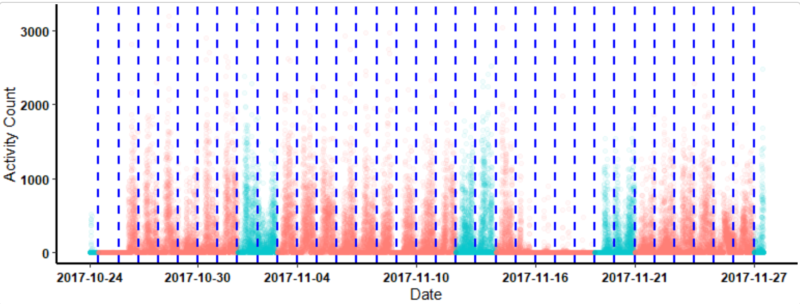
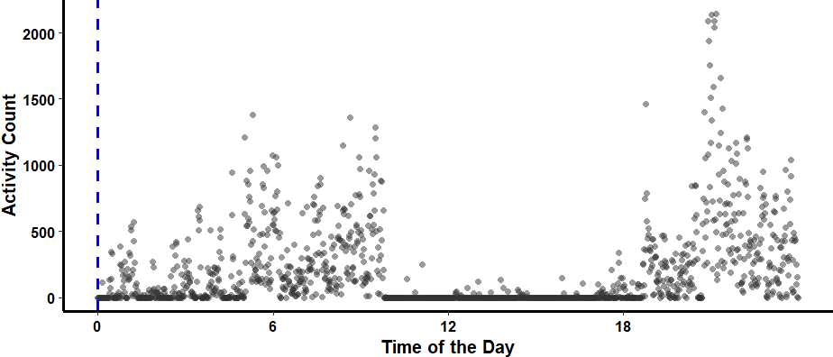
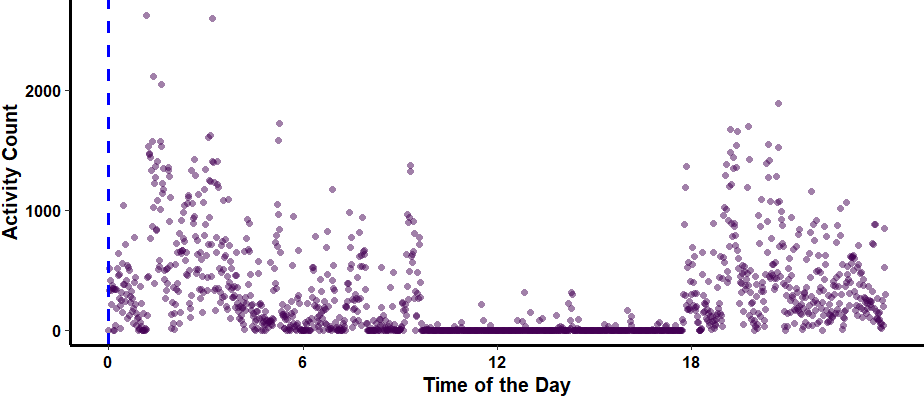

## What will be covered in this tutorial?

This specific tutorial is designed to show users how to generate a graphic/text report of daily actigraphy measures. For details on data harmonization and the analysis of daily actigraphy measures, please see the Time-Shift tutorials.

```{r, include = FALSE}
knitr::opts_chunk$set (
    collapse = TRUE,
    comment = "#>"
)
```

```{r setup, include = FALSE}
library (ActiGlobe)
```

```{r Load Data, message=FALSE, warning=FALSE, include = FALSE}
data ("FlyEast")
```

```{r BriefSum, message=FALSE, warning=FALSE, include = FALSE}
BdfList <-
    BriefSum (
        df = FlyEast,
        SR = 1 / 60,
        Start = "2017-10-24 13:45:00",
        TZ = "America/New_York"
    )
```


```{r eval=FALSE, message=FALSE, warning=FALSE, include=FALSE}
Bdf <- BdfList$Bdf
```

```{r View df, eval=FALSE, message=FALSE, warning=FALSE, include=FALSE}
df <- BdfList$df
```

```{r View TLog, eval=FALSE, message=FALSE, warning=FALSE, include=FALSE}
data (TLog)
```


```{r TAdjust, eval=FALSE, message=FALSE, warning=FALSE, include=FALSE}
Bdf.adj <- TAdjust (Bdf, TLog)
```

## Step 0: Pre-requisits

For this tutorial, it is essential that the recording be properly pre-processed (i.e., adjusted for time shifts due to travel or daylight saving). If this step has not been done, please go to the tutorial titled <b>Time-Shift</b>. Note that while the tutorial uses adjusted data affected by multiple sources of time shift, the same procedure can be used for any longitudinal recording, even if the recordings are not affected by time shift. See example in `?write.act`.

```{r eval=FALSE, include=FALSE}
dfList <- Act2Daily (
    df = df,
    Bdf = Bdf.adj,
    VAct = "Activity",
    VTm = "Time",
    Incomplete = FALSE,
    Travel = TRUE
)
```

An example of the adjusted longitudinal recording.

```{r example graph, eval=FALSE, warning=FALSE, include=FALSE}
df2 <- do.call (rbind, dfList$Daily_df)

ggActiGlobe (
    df = df2,
    Bdf = Bdf.adj,
    VAct = "Activity",
    VDT = "DateTime"
)
```


{width=600}

## Step 1: Segment Daily Recordings

To segment the recording by day, ActiGlobe uses `Act2Daily()` to segment the data. This will require users to provide the `BriefSum()` report and the recording. Since some may wish to modify the default column names, users will have to provide the names of the columns containing the activity count and time (generated by `BriefSum()`). Note that we can skip step 1 if we want to save daily recordings and review the pre-processed recordings directly from PDF.


### Visual Example of Segmented Daily Recording
```{r Automated Split Data, eval=FALSE, fig.height=3, fig.width=7, message=FALSE, warning=FALSE}
### Here, we selectively generate graphs at random for day 11 and day 12.
for (i in names (dfList$Daily_df) [11:12]) {
    ggActiGlobe (
        df = dfList$Daily_df [[i]],
        Bdf = Bdf.adj,
        VAct = "Activity",
        VDT = "DateTime"
    ) +
        scale_color_grey () #### Change the graph colour
}
```

{width=800}
{width=800}

## Step 2: Export Daily Recordings

Once the recordings are segmented, we can export daily recordings using the `write.act()` function, which internally calls `Act2Daily()`. If the goal is simply to segment data and create quick summaries for documentation or other purposes, we can bypass `Act2Daily()` altogether. However, for best practice, especially when handling many recordings, it is advisable for users to review some recordings with `Act2Daily()` during processing.

```{r write.act, echo = TRUE, eval=FALSE}
dfList <- write.act (
    Dir = "The_PATH_in_the_computer_WHERE_the_daily_recordings_will_be_stored",
    ID = "JD",
    df = df,
    Bdf = Bdf.adj,
    VAct = "Activity",
    VTm = "Time"
)
```


{height=200}


## Step 3: Generate Daily Reports

Once we are confident in the results of the pre-processing step, we can generate a graphical summary to help us review and document each segmented daily recording from `Act2Daily()`. Note, ActiGlobe appends all recordings to a single PDF file.

```{r write.cosinor, echo = TRUE, eval=FALSE}
dfList <- write.cosinor (
    Dir = "The_PATH_in_the_computer_WHERE_the_daily_recordings_will_be_stored",
    ID = "JD",
    DailyAct = dfList$Daily_df,
    Bdf = Bdf.adj,
    VAct = "Activity",
    VTm = "Time"
)
```
