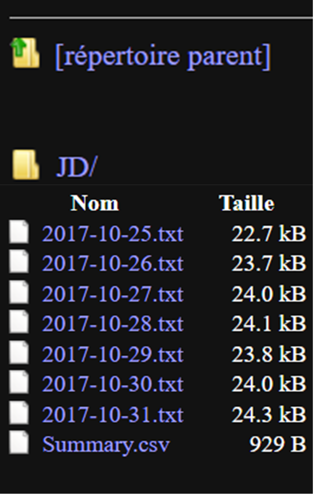

## What will be covered in this tutorial?

This specific tutorial is designed to show users how to use generate graphic/excel report of daily actigraphy measures. For details on data harmonization and analysis of daily actigraphy measures, please go to the respected tutorials.

```{r, include = FALSE}
knitr::opts_chunk$set(
  collapse = TRUE,
  comment = "#>"
)
```

```{r setup, include = FALSE}
library(ActiGlobe)
```

```{r Load Data, message=FALSE, warning=FALSE, include = FALSE}
data("FlyEast")

```

```{r BriefSum, message=FALSE, warning=FALSE, include = FALSE}
BdfList = 
BriefSum(df = FlyEast,
         SR = 1/60,
         Start = "2017-10-24 13:45:00")


```


```{r eval=FALSE, message=FALSE, warning=FALSE, include=FALSE}
Bdf <- BdfList$Bdf
```

```{r View df, eval=FALSE, message=FALSE, warning=FALSE, include=FALSE}
df <- BdfList$df
```

```{r View TLog, eval=FALSE, message=FALSE, warning=FALSE, include=FALSE}
data(TLog)

```


```{r TAdjust, eval=FALSE, message=FALSE, warning=FALSE, include=FALSE}
Bdf.adj = TAdjust(Bdf, TLog)
```

## Step 0: Pre-requisits

For this tutorial, it is essential that the recording is properly pre-processed (i.e., adjusted for time shift due to travel or daylight saving). If this step has not been done, please, go tutorial titled, Advanced Data Harmonization. Note, while the tutorial uses the adjusted data affected by multiple source of time shift, the same procedure can be used for any longitudinal recording even if the ones unaffected by time shift. See example in `?write.act`.

```{r eval=FALSE, include=FALSE}
dfList = Act2Daily(df = df,
                   Bdf = Bdf.adj,
                   VAct = "Activity",
                   VTm = "Time",
                   Incomplete = FALSE,
                   Travel = TRUE)
```

An example of the adjusted longitudinal recording.

```{r example graph, eval=FALSE, warning=FALSE, include=FALSE}
df2 <- do.call(rbind, dfList$Daily_df)

ggActiGlobe(df = df2, 
               Bdf = Bdf.adj,
               VAct = "Activity",
               VDT = "DateTime")
```


{width=600}

## Step 1: Segment Daily Recordings

To segment the recording by day, ActiGlobe uses `Act2Daily()` to segment the data. This will require users to provide the `BriefSum()` report and the recording. Since some may wish modify the default column names, users will have to provide the name of the columns containing the activity count and time (generated by `BriefSum()`) Note, that we can skip step 1 if we want to save daily recordings and review the pre-processed recordings directly from PDF.


### Visual Example of Segmented Daily Recording
```{r Automated Split Data, eval=FALSE, fig.height=3, fig.width=7, message=FALSE, warning=FALSE}
### Here, we selectively generate graphs at random for day 11 and day 12.
for(i in names(dfList$Daily_df)[11:12]) {
  
  ggActiGlobe(df = dfList$Daily_df[[i]],
              Bdf = Bdf.adj,
               VAct = "Activity",
               VDT = "DateTime") +
    scale_color_grey()   #### Change the graph colour
  
}
```

{width=800}
{width=800}

## Step 2: Export Daily Recordings

After the recordings are segmented, we can export daily recordings using the `write.act()` function. Note that write.act uses `Act2Daily()` in the background. So we can also skip Act2Daily entirely if the goal is to segment the data and the quick summary for documentation or other uses. Nevertheless, it is recommend that users review at least some of the recordings using `Act2Daily()` when processing large number of recordings.

```{r write.act, echo = TRUE, eval=FALSE}
dfList = write.act(Dir = "The_PATH_in_the_computer_WHERE_the_daily_recordings_will_be_stored",
                   ID = "JD",
                   df = df,
                   Bdf = Bdf.adj,
                   VAct = "Activity",
                   VTm = "Time")
```


{height=200}


## Step 3: Generate Daily Reports

Once, we are confident with the results from the pre-processing step, we can generate some graphic summary to help us review and document each segmented daily recording from `Act2Daily()`. Note, ActiGlobe appends all recordings in one single pdf file.

```{r write.cosinor, echo = TRUE, eval=FALSE}
dfList = write.cosinor(Dir = "The_PATH_in_the_computer_WHERE_the_daily_recordings_will_be_stored",
                       ID = "JD",
                       DailyAct = dfList$Daily_df,
                       Bdf = Bdf.adj,
                       VAct = "Activity",
                       VTm = "Time")
```
