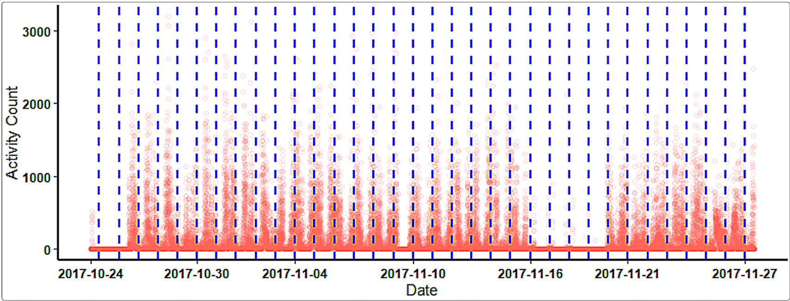

```{r, include = FALSE}
knitr::opts_chunk$set(
  collapse = TRUE,
  comment = "#>"
)
```

## What will be covered in this tutorial?

This specific tutorial is designed to give users a gentle introduction
to actigraphy and R. For tutorials on how to use ActiGlobe, please go
to the rest of the tutorials in this package.

## Load the Libraries

```{r setup, eval=FALSE}
library(ActiGlobe)

### Optional Library
# library(zeallot)
```

If any of the packages have yet to be installed, we can always install
them using the function `install.packages()`.

## Introduction

### What is Actigraphy?

Actigraphy is a non-invasive method used for measuring sleep/wake
cycles by using a small device, usually in the form of a wrist-worn
watch. It is the easiest way to measure sleep in the field and is
widely used in the realm of sleep research due to its extended
recording time and ease of use (Smith et al., 2018). An actigraphy
device has a built-in accelerometer that measures movement, allowing
researchers to objectively track activity patterns over days, weeks, or
even months.

### Understanding Accelerometers and Gyroscopes

Modern actigraphy devices rely on sophisticated sensors to capture
movement data:

#### Accelerometers

An **accelerometer** is a sensor that measures acceleration, or more
simply, motion in one direction. It works by converting physical
movement into electrical signals that the device can interpret and
store. A 3-axis (or tri-axial) accelerometer measures acceleration
along three perpendicular axes (X, Y, and Z), which correspond to
different directions in three-dimensional space. This allows the device
to track all types of motion, whether you are walking, running, or
lying in bed.

More specifically, an actigraph outputs the magnitude of acceleration
(i.e., the vector magnitude of acceleration across all three axes),
which is then used by algorithms to classify periods of activity versus
rest. For instance, if you are out on a run, as your feet pound against
the pavement and your arm swings back and forth, the device on your
wrist will detect a sharp increase in the magnitude of acceleration,
signaling that you are wide awake and on the move. In contrast, if you
are curled up in bed fast asleep, the magnitude will greatly decrease
and stabilize, allowing the device to easily discern that you are in a
period of sleep or rest.

#### Gyroscopes

While accelerometers measure linear acceleration, **gyroscopes** measure
angular velocity or rotational movement. Some advanced actigraphy
devices incorporate gyroscopes to provide a more complete picture of
movement. By combining data from both accelerometers and gyroscopes,
these devices can better distinguish between different types of
activities (e.g., walking vs. cycling) and reduce errors caused by
device orientation.

### On-Device Filtering and Data Acquisition

To enable prolonged and uninterrupted data collection while managing
storage limitations, most clinical and research-grade actigraphy devices
implement **on-device filtering** and data processing:

#### Signal Processing

Raw acceleration signals from the accelerometer are typically sampled at
high frequencies (e.g., 32 Hz or higher). However, storing raw
high-frequency data for weeks or months would require enormous storage
capacity. To address this, devices apply on-device signal processing:

1.  **Bandpass Filtering**: Raw acceleration signals are filtered to
    remove high-frequency noise and low-frequency drift, typically
    retaining frequencies associated with human movement (approximately
    0.25–3 Hz).

2.  **Magnitude Calculation**: The device computes the vector magnitude
    of acceleration across the three axes:
    
    $\text{Magnitude} = \sqrt{x^2 + y^2 + z^2}$
    
    where $x$, $y$, and $z$ represent acceleration along each axis.

3.  **Epoch Aggregation**: The filtered magnitude values are aggregated
    over fixed time intervals called **epochs** (commonly 15, 30, or 60
    seconds). Aggregation methods include summing, averaging, or taking
    the maximum value within each epoch.

4.  **Activity Counts**: The resulting value for each epoch is stored as
    an "activity count" — a unitless measure that represents the amount
    of movement detected during that time period.

This approach dramatically reduces data storage requirements while
preserving the essential information needed for sleep/wake analysis and
circadian rhythm assessment.

#### Time Stamping and Time Zone Considerations

To allow for prolonged and uninterrupted data collection, most clinical
and research-grade actigraphy devices record only the time and time zone
at the initiation of recording. When no travel occurs during the
recording period, one can easily infer the time coordinates of all
recorded activity counts.

However, time zone changes during data collection present a unique
challenge. For example, if a Canadian researcher is initializing devices
for a study that collects data before, during, and after travel to
Europe, they face a difficult choice: Should the watches be set to
Montreal time (UTC-4) or Paris time (UTC+2)? Unfortunately, most
actigraphy devices are not flexible enough to automatically adjust for
time zone changes during recording.

### The Need for ActiGlobe

When a wearer is engaged in long-distance or cross-time-zone travel, the
fixed time zone setting becomes problematic. The time zone switch is not
automatically recorded or adjusted, which can lead to significant
misinterpretation of the data.

Consider the example shown in Figure 1 below from an Actiwatch® device
(Varesco et al., 2024). When looking at the raw data without adjustment,
the activity count appears noticeably high in the middle of the night
(on/right side of the blue line) around November 5th. Moreover, the
activity count is low in the middle of the day, leading to the erroneous
conclusion that the subject was sleeping during the day and awake at
night.

```{r unadjusted-plot, echo=FALSE, fig.cap="Figure 1: Unadjusted actigraphy data showing apparent day-night reversal due to unaccounted time zone change.", out.width="100%"}

```

This issue is due to a time zone change that the hardware and software
are not aware of. The device continues recording throughout the travel
period; thus, the data becomes confusing and produces skewed outcomes.
Unaltered data after cross-time-zone travel makes processing and
extracting results much more complicated and can lead to incorrect
scientific conclusions.

**ActiGlobe** was developed specifically to address this challenge. By
allowing researchers to specify travel logs and time zone transitions,
ActiGlobe can adjust actigraphy data to reflect the correct local time
throughout the recording period. This ensures that analyses of
sleep/wake patterns, circadian rhythms, and activity levels are
accurate and interpretable, even when participants travel across
multiple time zones.

Figure 2 shows the same data after time zone adjustment using
ActiGlobe:

```{r adjusted-plot, echo=FALSE, fig.cap="Figure 2: Adjusted actigraphy data showing correct sleep/wake patterns after time zone correction.", out.width="100%"}
knitr::include_graphics("images/Adjusted_Overview.png")
```

After adjustment, the data clearly shows appropriate sleep periods at
night and activity during the day, demonstrating the importance of
proper time zone handling in actigraphy research.

## Getting Started with ActiGlobe

Now that you understand the fundamentals of actigraphy and the
challenges of time zone adjustments, you are ready to explore the
ActiGlobe package. The following vignettes will guide you through:

-   **Time-Shift Adjustment**: Learn how to adjust actigraphy data for
    time zone changes and daylight saving time transitions.
-   **Circadian Analysis**: Perform cosinor analysis to characterize
    circadian rhythms and estimate parameters like MESOR, amplitude, and
    acrophase.
-   **Graphic Reports**: Generate comprehensive visual reports to
    communicate your findings effectively.

We encourage you to work through each tutorial to become familiar with
the ActiGlobe workflow and discover how this tool can enhance your
actigraphy research.

## References

Smith, Michael T., et al. "Use of Actigraphy for the Evaluation of
Sleep Disorders and Circadian Rhythm Sleep-Wake Disorders: An American
Academy of Sleep Medicine Systematic Review, Meta-Analysis, and GRADE
Assessment." *Journal of Clinical Sleep Medicine*, vol. 14, no. 07,
July 2018, pp. 1209–30. DOI: https://doi.org/10.5664/jcsm.7228.

Varesco, G., Yao, C. W., Dubé, E., Simonelli, G., & Bieuzen, F. (2024).
"Time zone transitions and actigraphy data adjustment for circadian
rhythm research." *The Journal of Physiology*. DOI:
https://doi.org/10.1113/ep092195.