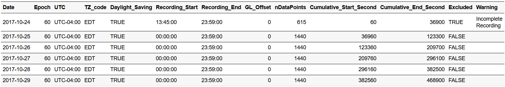
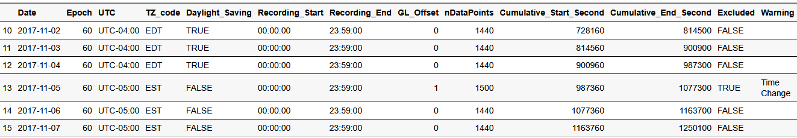
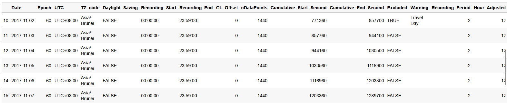

## What will be covered in this tutorial?
This specific tutorial is designed specifically to show users how to use ActiGlobe to preprocess longitudinal actigrpahy recordings affected by time shift. For analysis and generation of graphic/excel report of daily actigraphy measures, please go to tutorial title: Graphic-Report.


```{r, include = FALSE}
knitr::opts_chunk$set(
  collapse = TRUE,
  comment = "#>"
)
```

## Load the Libraries
```{r setup}
library(ActiGlobe)

### Optional Library
# library(zeallot)
```
If any of the packages has yet been installed, we can always install them using the function ["install.packages()"]. 


## Load Example Data: FlyEast
```{r Load Data, message=FALSE, warning=FALSE, results='hide'}
data("FlyEast")

head(FlyEast) ### Only the first few lines
```


```{r message=FALSE, warning=FALSE,echo=FALSE, out.width="30%", paged.print=TRUE, tab.cap = "Table 1. An Overview of the FlyEast Dataset"}
knitr::kable(head(FlyEast))
```

For more information, type `?FlyEast` or `help(FlyEast)` in your R console.

< Tip for Beginner to R> 
1. Type: View(FlyEast) in the R console will allow users to review the data structure of FlyEast.
2. Use <b>Tab</b> button to help finish the code. Try typing: "Fly" in the Console (i.e., the window where we can see a `>`), then press the button <b>Tab</b> on the keyboard.


## Step 0. Create a brief summary of the recordings
In general, when pre-processing or harmonizing large volumes of data, it's good practice to first generate a structured summary of the dataset.

Here, we use `BriefSum()` to generate an initial summary of the actigraphy data recorded in FlyEast. Based on the initial recording time, it runs through the raw recording file to provide a quick overview with simple summaries for each recording day and a newly enriched actigraphy data. This pre-processing step also automatically adds timestamps to the original longitudinal recording. If the original location inherits the practice of daylight-saving transitioning, `BriefSum()` would also automatically handle any gain or loss in time. By default, `BriefSum()` would allow us to store both the summary and the newly enriched recording data in a `data.list`.

```{r BriefSum, message=FALSE, warning=FALSE}
BdfList <-
  BriefSum(
    df = FlyEast,
    SR = 1 / 60,
    Start = "2017-10-24 13:45:00"
  )


str(BdfList, max.level = 1) ### An overview of the output structure from BriefSum()
```

We can also take the advantage of `zeallot` to store multiple outputs at once just like in `Matlab` and `Python`.

```{r eval=FALSE}
c(Bdf, df) %<-%
  BriefSum(
    df = FlyEast,
    SR = 1 / 60,
    Start = "2017-10-24 13:45:00"
  )
```

In the brief summary of daily recording, we would have thirteen parameters, including the information on the beginning and the end of each daily recording period, labels warning the total time of a recording is less than 24 hours and the presence of daylight-saving time (based on the initial time zone).

```{r message=FALSE, warning=FALSE, results='hide'}
Bdf <- BdfList$Bdf
head(Bdf)
```


```{r echo=FALSE, message=FALSE, warning=FALSE, fig.cap="Table 2 The Header of Bdf", fig.width=8}


```

In the enriched data - `df`, we have both the original data stored in `FlyEast` and some new information, such as the time stamp of each data point.

```{r View df, message=FALSE, warning=FALSE, results='hide'}
df <- BdfList$df

head(df) ### This should give us the same first few lines of FlyEast dataset with a few new columns created by [BrifSum()].
```

```{r message=FALSE, warning=FALSE,echo=FALSE, out.width="30%", paged.print=TRUE,tab.cap = "Table 3. BriefSum Enriched Longitudinal Recording"}
knitr::kable(head(df), format = "html", table.attr = "style='width:800px;'")
```
For longitudinal recordings that did not involve long-distance travel, we may simply stop here and proceed to estimate cosinor parameters for further analysis. But given that `ActiGlobe` was designed specifically to harmonize and correct recordings affected by time zone changes. We have to take a few more steps to clean up the data.

## Step 1: Look into a travel diary

While users born after 2YK may not be familiar with the concept of a travel diary, it was relatively popular among young travellers to document their journeys while travelling. These physical notebooks generally come with item-wise spaces to jot down our trip itinerary, including date, time and destination. This information is crucial for properly sorting the recordings by day and for correcting the previously created timestamps by `BriefSum` to match the destination.

Fortunately, we already created something similar for this tutorial - TLog. The `TLog` was created using the standard travel diary template, which can be created using the function `TravelLog()`. For more information on the standard travel diary, type `?TravelLog` or `help(TravelLog)` in the R console.

```{r View TLog, message=FALSE, warning=FALSE, results='hide'}
data(TLog)

head(TLog)
```

```{r message=FALSE, warning=FALSE,echo=FALSE, out.width="30%", paged.print=TRUE, tab.cap = "Table 4. An Example of a Standard Travel Diary Template"}
knitr::kable(TLog, format = "html", table.attr = "style='width:800px;'")
```

This simplified travel diary is essential for pre-processing actigraphy data using `ActiGlobe`. The diary contains five columns to help document the itinerary for each trip that the wearer took. By default, the first row should contain the information about the original location when the recording started. Here, one may notice our intentional design of the template to record the UTC offset by default, rather than the actual geological location. This strategy aims to reduce the level of intrusiveness that participants may feel when asked to provide details of their trip. Since daylight saving is not always a shared practice for all geological locations within the same time zone or even the same country, it is important to add this information because it can affect up to one hour in difference when correcting for time stamps.

To facilitate the documentation of the travel log, we also include a copy of the standard Internet Assigned Numbers Authority (IANA) timetable in ActiGlobe. We can simply use `View(IANA)` to pull up the 2025b version of the timetable.

```{r IANA header, message=FALSE, warning=FALSE, results='hide'}
data(IANA)

head(IANA)
```

```{r message=FALSE, warning=FALSE, echo=FALSE, out.width="30%", paged.print=TRUE, tab.cap = "Table 5. An Overview of the 2024 IANA Time Zone Database"}
knitr::kable(head(IANA), format = "html", table.attr = "style='width:450px;'")
```
## Step 2: Adjust time change based on the travel diary
###  {.scrollable}
Before `ActiGlobe` directly modify information stored in the enriched longitudinal recording - `df`, we will need to adjust the brief summary stored in `Bdf`. This design allows us to quickly scan through the summary file, just in case any adjustment is not properly addressed.

```{r TAdjust, eval=FALSE, message=FALSE, warning=FALSE}
Bdf.adj <- TAdjust(Bdf, TLog)
```


When we put it side-by-side with the initial brief summary, we can see clear changes across the various documents regarding the recordings and their annotations.

```{r eval=FALSE, message=FALSE, warning=FALSE, paged.print=TRUE}
knitr::kable(Bdf[10:15, ]) ### Only display 6 days
```


```{r echo=FALSE, message=FALSE, warning=FALSE, tab.cap="Table 6 Initial Brief Summary of the Recording", fig.width=10}


```


```{r eval=FALSE, message=FALSE, warning=FALSE, paged.print=TRUE}
knitr::kable(Bdf.adj[10:15, ]) ### Only display 6 days
```


```{r echo=FALSE, message=FALSE, warning=FALSE, tab.cap="Table 7. Adjusted Brief Summary of the Recording", fig.width=12}


```


When we compare the overview of the longitudinal recording, we can also see clear changes in the various documentations about the recordings and their annotations


```{r Original_Data, eval=FALSE, message=FALSE, warning=FALSE, fig.height=3, fig.width=8}
ggActiGlobe(
  df = df,
  Bdf = Bdf,
  VAct = "Activity",
  VDT = "DateTime"
)
```


```{r echo=FALSE, message=FALSE, warning=FALSE, fig.cap="Figure 1. An Overview of Unadjusted Recordin"}
knitr::include_graphics("images/Unadjusted_Overview.png",dpi = 200)

```


```{r Pre-processed_Data, eval=FALSE, message=FALSE, warning=FALSE}
### Reconstruct the longitudinal recording with proper segmentation
dfList <- Act2Daily(
  df = df,
  Bdf = Bdf.adj,
  Incomplete = TRUE,
  Travel = TRUE
)

df2 <- do.call(rbind, dfList$Daily_df)

ggActiGlobe(
  df = df2,
  Bdf = Bdf.adj,
  VAct = "Activity",
  VDT = "DateTime"
)
```


```{r echo=FALSE, message=FALSE, warning=FALSE, fig.cap="Figure 2. An Overview of Adjusted Recordin"}
knitr::include_graphics("images/Adjusted_Overview.png",dpi = 200)

```

We can also use the following code to look at each daily recording separately. Note that the code below was intentionally left without generating any output plot to avoid overcrowding this tutorial.

1. Unadjusted Original Recording
```{r Original Daily, eval=FALSE, fig.height=5, fig.width=7}
for (i in seq_along(length(x))) {
  x <- Bdf$Cumulative_Start_Second
  y <- Bdf$Cumulative_End_Second
  GX <- df$Activity[(x[i]:y[i]) / 60]
  print(plot(GX, main = i, font.lab = 2, ylab = "Activity (counts)"))
}
```

2. Time-shift Adjusted Recording
```{r Adjusted Daily, eval=FALSE, fig.height=5, fig.width=7}
for (i in seq_alonglength(x))) {
  x <- Bdf.adj$Cumulative_Start_Second
  y <- Bdf.adj$Cumulative_End_Second
  GX <- df$Activity[(x[i]:y[i]) / 60]
  print(plot(GX, main = i, font.lab = 2, ylab = "Activity (counts)"))
}
```

3. Time-shift Adjusted Recording
```{r Automated Split Data, eval=FALSE, fig.height=5, fig.width=7, message=FALSE, warning=FALSE}
for (i in names(dfList$Daily_df)) {
  plot(dfList$Daily_df[[i]]$Activity, main = i, font.lab = 2, ylab = "Activity (counts)")
}
```

Refer to the 'Graphic-Report' tutorial for instructions on how to segment and export recordings by day, as well as how to generate a graphic report.
